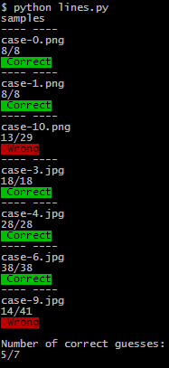

# Python text lines counter

Detects number of text lines for a given scanned textual document (image or a folder). 

- Text must have only straight text lines arranged in one column (no images or tables)
- Image may be rotated.
- Text can be written in any language, any font or size
- Needs about 2 seconds per picture




### Usage

Whole folder

```python
python lines.py
>> samples
```

Single file

```python
python lines.py
>> samples\case-0.png
```